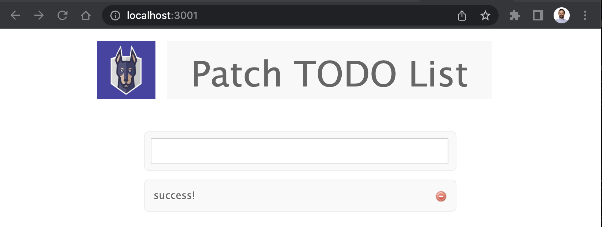

# Module 1: Prepare your Local Dev Environment

The first step in fixing a problem is knowing there's a problem. This first step is critical in allowing Security Teams to identify their most vulnerable applications and the most important vulnerabilities that need developer attention. 

## Step 1: Get the sample app and clone the Repo

A Template GitHub Repo containing an intentionally vulnerable application is provided for this workshop. [Access it here](https://github.com/tomgonzo/node-goof/).

Click "Use this Template" to create a copy of this Repo into your GitHub account. 

To properly copy-paste the commands in these instructions leave the repo name as `node-goof`. Otherwise, ensure the command uses the correct repo name.

If you want to copy-paste commands, set an environment variable for your GitLab ID.

```bash
echo "Set an environment variable for your GitHub ID"
echo "Your GitHub ID is what comes after https://github.com/ in the URL, for example https://github.com/gitHubId"
echo "You can also see your GitHub ID by clicking your User Portrait in the Upper Right corner"
gitHubId=<<your_github_id>>
```

Open VS Code, and clone the Repo to your local environment, then `cd` into it.

```bash
echo "Clone the Goof Repo and CD into it."
git clone https://www.github.com/$gitHubId/node-goof && cd node-goof
```

## Step 2: Test the Application locally

### Install Dependencies

To run our application locally, we need to install its dependencies first.

```bash
echo "Install npm dependencies"
npm install
```

### Start the Mongo database

The app requires an old version of MongoDB to work. We'll run it in a Docker container.

```bash
echo "Start detached mongo with container port 27017 mapped to host port 27017"
docker run -d -p 27017:27017 mongo:3
```

You can verify that mongo is running by running `docker ps`.

```bash
docker ps
```

### Start the Application

Now you can run the application. 

```bash
node app.js
```

Once it starts, it will be available at [http://localhost:3001](http://localhost:3001). Verify it works by adding a few items into the todo list. 



Success! Now that we know it works, let's package it in a container for distribution.

## Build the Docker Image

The `Dockerfile` in the repo tells `docker build` how to build the container. To learn more about Dockerfile commands, visit [Docker's documentation](https://docs.docker.com/engine/reference/builder/). A summary is provided below:

```Dockerfile
FROM node:10.4 ## Use Node 10.4 as our base image

RUN mkdir /usr/src/goof ## Create the directory for our application
RUN mkdir /tmp/extracted_files
COPY . /usr/src/goof ## Copy the current directory files into the image
WORKDIR /usr/src/goof ## Set the working directory

RUN npm update ## Ensure npm is up to date
RUN npm install ## Install dependencies
EXPOSE 3001 ## Expose the port
EXPOSE 9229
ENTRYPOINT ["npm", "start"] ## The command 
```

When ready, build and tag the container image to get it ready to push into GitLab Container Registry.

```bash
echo "Build the container"
docker build -t ghcr.io/$gitHubId/node-goof:dev .
```

Before you can push Images to GitHub Container Registry, you'll need to authenticate your VS Code to GitHub Container Registry. To do this, you'll need a GitHub Personal Access Token (PAT). Create one following the [GitHub Documentation](https://docs.github.com/en/packages/working-with-a-github-packages-registry/working-with-the-container-registry#authenticating-with-a-personal-access-token-classic).

Once you have your PAT ready, run the following command, providing your PAT.

```bash
export CR_PAT=YOUR_TOKEN
```

Now you're ready to Authenticate to GitHub Container Registry executing the following command:

```bash
echo "Authenticate with GitHub Container Registry"
echo $CR_PAT | docker login ghcr.io -u $gitHubId --password-stdin
```

Once authenticated, push the container to GitHub Container Registry.

```bash
echo "Push to GitHub Container Registry"
docker push ghcr.io/$gitHubId/node-goof:dev
```

## Optional Step: Deploy the application to Kubernetes

To ensure the container deploys correctly into Kubernetes without incurring cloud costs, we can use the Kubernetes cluster shipped with Docker Desktop. Before deploying the app, you'll need to make a change to the app's deployment manifest. Open the file `goof-deployment.yaml` in a text editor.

Find these lines, and insert your GitHub ID where indicated. 

```yaml
spec:
  containers:
  - image: ghcr.io/$gitHubId/node-goof:dev #Edit with your GitHub ID
    name: goof
    imagePullPolicy: Always
```

Save your changes. Now you're ready to deploy the application. Run the following commands:

```bash
echo "Create a namespace"
kubectl create ns snyk-docker

echo "Set the current context to use the new namespace"
kubectl config set-context --current --namespace snyk-docker

echo "Spin up the goof deployment and service"
kubectl create -f goof-deployment.yaml,mongo-deployment.yaml
```

To check the status of the pods as the application comes up, use the following command:

```bash
kubectl get pods
```

Once both are running, the application should now be accessible in [http://localhost:3001](http://localhost:3001). Success!

## Create a CI/CD Delivery Pipeline

Now that our container builds and runs, we'll activate a delivery pipeline to re-build our container as code changes are made. 

We'll use GitHub branches to differentiate the Deploy-ready version of our container from the version we're actively developing, helping to track these two states of our code. 

### Create a GitHub branch for the Deployment-Ready code

In GitHub, create a new branch and call it `deploy`. 

The workflows in `.workflows/` define pipelines that containerize the application and publish it to GitHub Container Registry, tagged with the branch name.

### Visit GitHub Container Registry

In GitHub Container Registry, you'll now have three tags of the Goof Container Image,
* `dev` for the tag you pushed from your local environment
* `main` which represents the container version for your repo's `main` branch
* `deploy` which represents the deployment-ready version of our container tracked in the `deploy` branch

## Module Recap

By completing this module, you have a similar setup as a company using a CI pipeline as part of a DevOps workflow that automatically packages committed code changes into a container. As we're using a local cluster to test, we don't have a CD stage in our pipeline, but know that Kubernetes users can configure their environment to always pull the latest version of an image tag - in those cases, pushing a new tag is enough to trigger a re-deploy. 

Containerizing an application doesn't automatically make it secure - as we know this application is intentionally vulnerable. In the next Module you'll learn how to find vulnerabilities in this application, adding the "Sec" to this DevOps setup.
