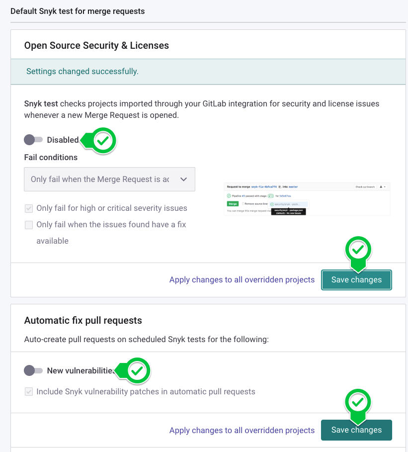
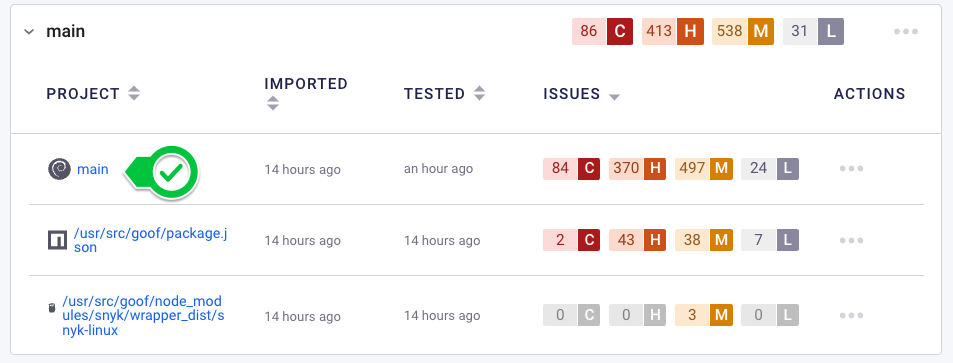
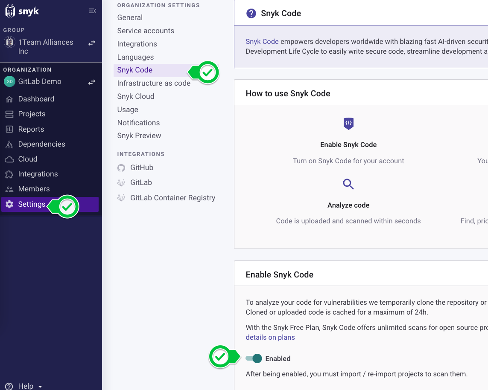
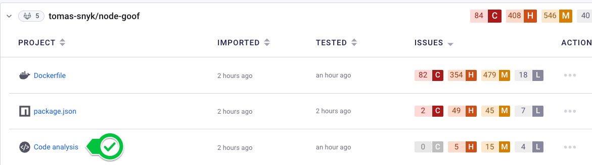
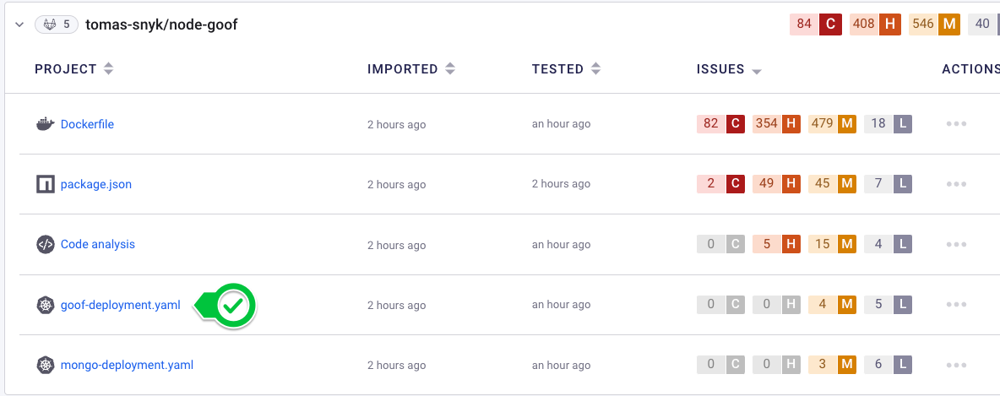

# Module 2: Gain Visibility into the Security of your Containers

In this module you'll play the part of a security analyst wanting to Gain Visibility over the threats in their application landscape. The intent of first gaining visibility is to do so in a way that doesn't immediately impact developer workflows, as you'll need their support down the line to remediate any issues that are found. Let's get started!

## Connect Snyk to GitHub

If you signed up for Snyk using your GitHub Account, you can skip this step. Otherwise, follow the steps to [Configure the GitHub Integration](https://docs.snyk.io/integrations/git-repository-scm-integrations/github-integration#setting-up-a-github-integration). 

Once the integration is configured you should see a `Connected to GitHub` message.

### Configure Additional SCM Integration Settings

A key part of not interrupting developer workflows is minimally introducing changes to their daily routines. 

Scroll down in the Integration Settings, and you'll observe that you can enable the GitHub integration can perform tests on Merge Requests and Automatic Fill Pull Requests. 



For now, disable these two settings. We'll enable them later.

### Kick off the Project Import

Once the integration is configured, import the node-goof repo into Snyk via the `Add Projects` button.

## Gain Visibility by connecting Snyk to the GitHub Container Registry

While the import runs, we can configure the GitHub Container Registry integration in Snyk. Navigate to Integrations -> GitHub Container Registry.

Provide your GitHub Username and PAT, with `ghcr.io` as the Container Registry URL. You can use the same PAT from Module 1, which can be retrieved by running the following command:

```bash
echo $CR_PAT
```

### Import the Container Image to Snyk

Once configured, you can import the Container Image into Snyk via the Add Projects button. You'll need to manually enter the image name.

When prompted, enter the container name "your_github_id/node-goof:main". Repeat the process for the `deploy` tag.

Once complete, you'll see the two tags represented in the Snyk UI. 

## Explore the Snyk Results

Once the imports complete, you'll be alerted that your Container and Repo have hundreds if not thousands of issues. 

Traditionally, developers would've been provided a list of these Hundreds or Thousands of vulnerabilities, and been told to go fix, without any context or true help from their security team guiding them toward the most important issues. 

DevSecOps is about Security and Development working `together`, we'll explore how Snyk can help us accomplish that.

### Explore Vulnerabilities in Container Libraries

Start by expanding the Imports from GitHub Container Registry. Observe that both the `main` and `deploy` tags have several critical vulnerabilities. Expanding each tag reveals that the majority of these critical vulnerabilities originate from the Container Base Image.  

Explore the `main` tag's base image vulnerabilities by clicking into the Project. 



Scrolling down allows you to see the full list of vulnerabilities present in the Base Image Libraries for our Container, organized by Snyk's Priority Score.

Near the top, Snyk also tells us that choosing a more secure Base Image is a way to remediate potentially hundreds of vulnerabilities in one go. This single high impact item can significantly reduce vulnerability counts, without flooding developers with thousands of vulnerabilities to fix. As a security analyst, this positions you to pose developers a single question - *would we be able to upgrade to a more secure base image?* 

Even better, you'll have recommendations of more secure base images to provide them, steering them toward a fix. 

### Explore Vulnerabilities in Application Libraries

Next, return to the Projects page and expand the Import from GitHub. In the Repo view we can see issues exist across various files! Navigate to the `package.json` project, as this contains the dependencies our application needs to function. 

Same as before, you're presented with a list of vulnerabilities. Once again, instead of giving developers a long list of vulnerabilities to fix, you can use Filters to identify those that present the highest risk. Apply the filters for `Critical` severity, `Mature` exploitability, and `Fixable`.

Narrowing down the list of issues to fix to those that present the highest impact (and risk) that can be actioned on by developers will once again allow you to have a conversation with them about addressing these risks. Drip-surfacing risks that are actionable, with the information in the Issue Card to guide you helps you, as a security analyst, become an ally to the developer helping them fix problems instead of simply throwing them over the fence.

### Explore Vulnerabilities in the Application's Code

To explore issues in the Application's Code, you first need to enable Snyk Code for your Organization. Users need to opt in for the Snyk Code analysis, as it requires uploading source code to Snyk in order to analyze it. 

### Enable Snyk Code and Re-Import the Repo

Navigate to Settings -> Snyk Code. Toggle the switch to enable it.



Now that Snyk Code is enabled, re-import the GitHub Repo using the Add Projects workflow. Once complete, you'll see a `Code Analysis` project. 



### Explore the Code Analysis Results

Explore the Code issues in your Project. To see more information about an issue, click "View Details". 

When available, you'll see the data flow for each issue, showing how Snyk determined this vulnerability can manifest.

In the Fix Analysis tab, developers have additional information that can help them fix the issue, such as a Description of the Fix, Fix Examples from Public Open Source Projects, and On-Demand E-Learning to help them learn more about this vulnerability and how to prevent it.

### Explore misconfigurations in Kubernetes Manifests

Finally, return to the Projects Page and explore either of the YAML manifests under the GitHub import.



These are configuration issues in our deployment manifests that could lead to insecure or unexpected behavior. 

## Getting Ready to Take Action

As a Security Analyst, you've just explored issues in your application across four different domains, all without interrupting developer workflows. You can now prepare yourself to have a conversation with your developers about these issues, helping them focos remediation efforts on the most critical ones. 

